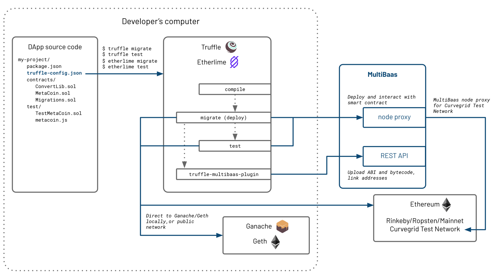

# truffle-multibaas-plugin

Integrate MultiBaas into your [Truffle Suite](https://github.com/trufflesuite/truffle) workflow!



MultiBaas is blockchain middleware that makes it fast and easy to develop, deploy, and operate on the Ethereum and OmiseGO blockchain platforms. This plugin makes it easy to deploy contracts to MultiBaas from within your existing Truffle workflow. Your DApp can then use the MultiBaas REST API to interact with smart contracts.

For more information on MultiBaas, see our [introductory walkthrough](https://www.curvegrid.com/blog/2020-04-06-multibaas-intro/) and our [developer documentation](https://www.curvegrid.com/docs/).

## Usage

### Installation

On your Truffle workspace, set up a `package.json` file (if not yet added) with

```bash
npm init
```

or

```bash
yarn init
```

Then, add the `truffle-multibaas-plugin` package:

```bash
npm i truffle-multibaas-plugin
```

or

```bash
yarn add truffle-multibaas-plugin
```

### Configuration

There are two API keys you need to prepare in your environment variables:

- `MB_PLUGIN_WEB3_KEY`: This comes from `Account > Connecting to Geth` from the MultiBaas dashboard.
- `MB_PLUGIN_API_KEY`: The API key, you can create one in `Account > API Keys` from the MultiBaas dashboard.
  An alternative to using this environment variable is to write a `mb_plugin_api_key` file.

For example, in the terminal where you will run `truffle deploy <network>`, you would first need to execute the following two commands
```sh
export MB_PLUGIN_WEB3_KEY=<MultiBaas API Key with Web3 permissions>

export MB_PLUGIN_API_KEY=<MultiBaas API Key with Blockchain Endpoint permissions>
```

Update your `truffle-config.js` as follows:

```js
const HDWalletProvider = require("@truffle/hdwallet-provider");

const MultiBaasDeploymentID = "<YOUR DEPLOYMENT ID>";

module.exports = {
  networks: {
    // This can be any name, not just "development". However, this is the default network name for Truffle.
    development: {
      // See https://github.com/trufflesuite/truffle/tree/develop/packages/hdwallet-provider
      provider: new HDWalletProvider("<YOUR PRIVATE KEY FOR SIGNING>", "http://ropsten.node-provider.example.com:8545"),
      network_id: 3,
    },
  },
  // other truffle settings

  // ADD THIS SECTION
  multibaasDeployer: {
    apiKeySource: "env", // specify "file" if you have a mb_plugin_api_key instead of an environment variable.
    deploymentID: MultiBaasDeploymentID,
    // Choose the list of networks we can allow updating address for a label.
    // A definitive true/false also works, it will allow/block the action for all networks.
    allowUpdateAddress: ["development"],
  },
};
```

For cases where MultiBaas is proxying the connection to the blockchain, for example with the Curvegrid Test Network (Curvenet), use the `truffle-multibaas-plugin` network provider directly in `truffle-config.js`:

```js
const { Provider } = require("truffle-multibaas-plugin");

const MultiBaasDeploymentID = "<YOUR DEPLOYMENT ID>";

module.exports = {
  networks: {
    // This can be any name, not just "development". However, this is the default network name for Truffle.
    development: {
      // See https://github.com/trufflesuite/truffle/tree/develop/packages/hdwallet-provider
      // for options other than the Deployment ID.
      provider: new Provider("<YOUR PRIVATE KEY FOR SIGNING>", MultiBaasDeploymentID),
      network_id: 2017072401,
    },
  },
  // other truffle settings

  // ADD THIS SECTION
  multibaasDeployer: {
    apiKeySource: "env", // specify "file" if you have a mb_plugin_api_key instead of an environment variable.
    deploymentID: MultiBaasDeploymentID,
    // Choose the list of networks we can allow updating address for a label.
    // A definitive true/false also works, it will allow/block the action for all networks.
    allowUpdateAddress: ["development"],
  },
};
```

### Writing a Migration File

See the **sample** folder for a complete [Truffle Quickstart Repo](https://www.trufflesuite.com/docs/truffle/quickstart)
connected to MultiBaas.

The quick-start drop-in will be from

```js
module.exports = async function(deployer, network) {
  // use the deployer
  await deployer.deploy(A);
  await deployer.deploy(B);
  // ...
}
```

to

```js
// Import the Deployer wrapper
const { Deployer } = require("truffle-multibaas-plugin");

module.exports = async function(_deployer, network) {
  const deployer = new Deployer(_deployer, network);
  await deployer.setup();

  // Continue as normal
  const [mbContract, mbAddress, truffleContract] = await deployer.deploy(A);
  await deployer.deploy(B);

  // Call smart contract functions
  await truffleContract.transfer(/* ... */);
  // ...
}
```

### Deploy options

You can use either the Truffle-deployer compatible

```js
deployer.deploy(Contract, args..., options)
```

or the more recommended

```js
deployer.deployWithOptions(options, Contract, args...)
```

The available options are:

```ts
interface DeployOptions {
  /**
   * Truffle's "overwrite" property. Defaults to `false`.
   */
  overwrite?: boolean;
  /**
   * Overwrite the default contractLabel. If set and a duplicate is found,
   * the contract is assigned a newer version.
   */
  contractLabel?: string;
  /**
   * Version override. Will fail if another binary with the same version is found.
   */
  contractVersion?: string;
  /**
   * Overwrite the default address label. If set and a duplicate is found,
   * the address is instead updated (or returned with an error, chosen by global setting `allowUpdateAddress`).
   *
   * The auto-generated address label is never a duplicate.
   */
  addressLabel?: string;

  // and any other parameters that will be passed down to web3 (gas, from, etc.)
  [key: string]: any;
}
```

## Copyright

Copyright (c) 2020 Curvegrid Inc.

## Contributing

[Pull requests](https://github.com/curvegrid/truffle-multibaas-plugin/compare) welcome.
